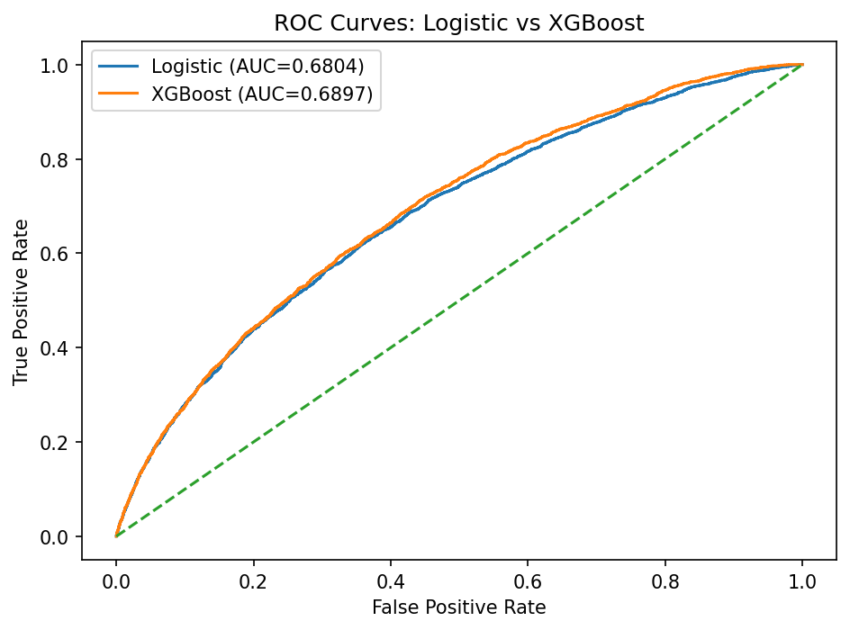
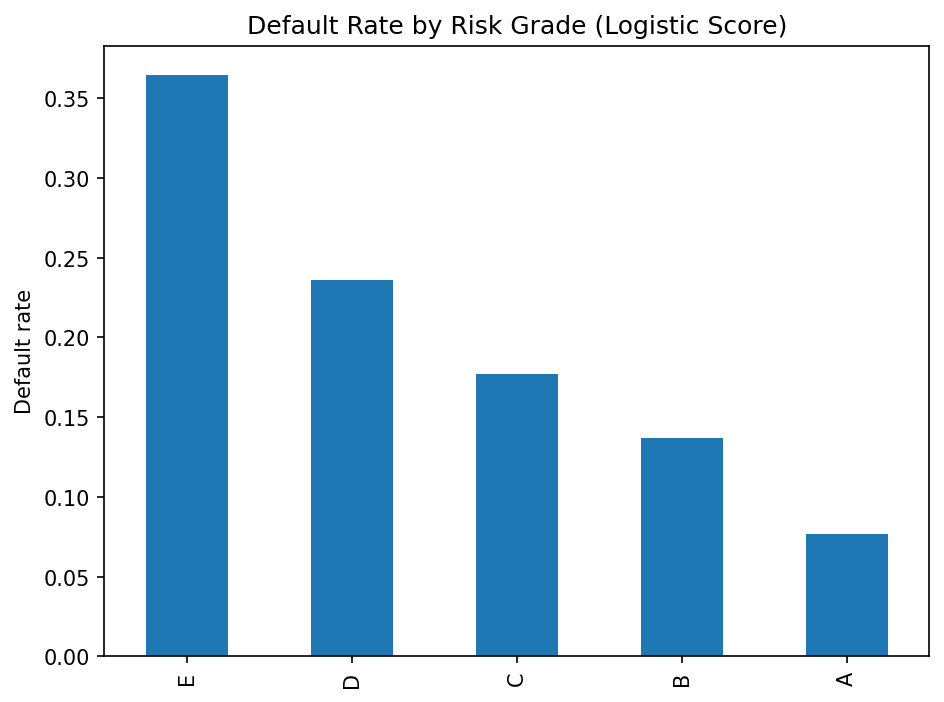
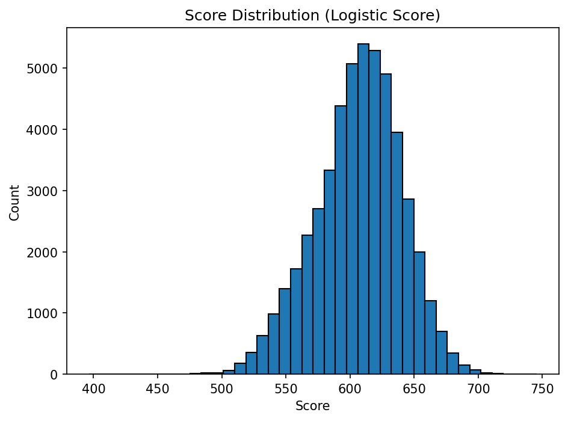

## Credit Risk Modeling – LendingClub

### Overview
This project develops an end-to-end credit risk model using publicly available LendingClub loan data. The objective is to estimate probability of default (PD), benchmark predictive performance, and perform portfolio-level monitoring suitable for credit risk analysis.

### Data
- Source: LendingClub loan-level dataset (2M+ records)
- Final modeling sample: ~50,000 loans after eligibility filtering and data cleaning

### Methodology
- Data cleaning and feature engineering
- Logistic regression for PD estimation
- Benchmarking against XGBoost
- Score transformation and A–E risk grading
- Portfolio monitoring and stability analysis (PSI)

### Key Results
- Logistic regression test AUC: 0.68
- XGBoost benchmark AUC: 0.69 (marginal lift)
- Clear separation of default rates across risk grades
- Stable population between train and test samples (low PSI)

### Model Performance

#### ROC Curve

#### Default Rate by Risk Grade

#### Score Distribution

### Repository Contents
- Jupyter notebook with full modeling workflow
- Output figures (ROC curves, grade-level default analysis)

### Tools
Python (pandas, NumPy, scikit-learn, XGBoost, matplotlib)
